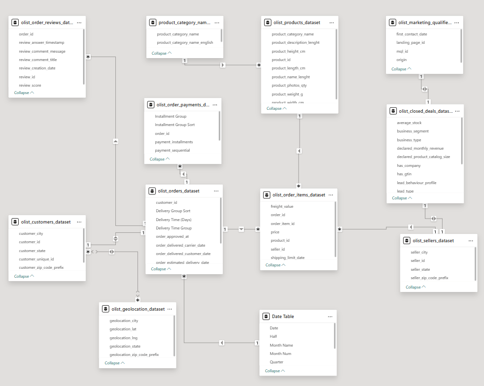
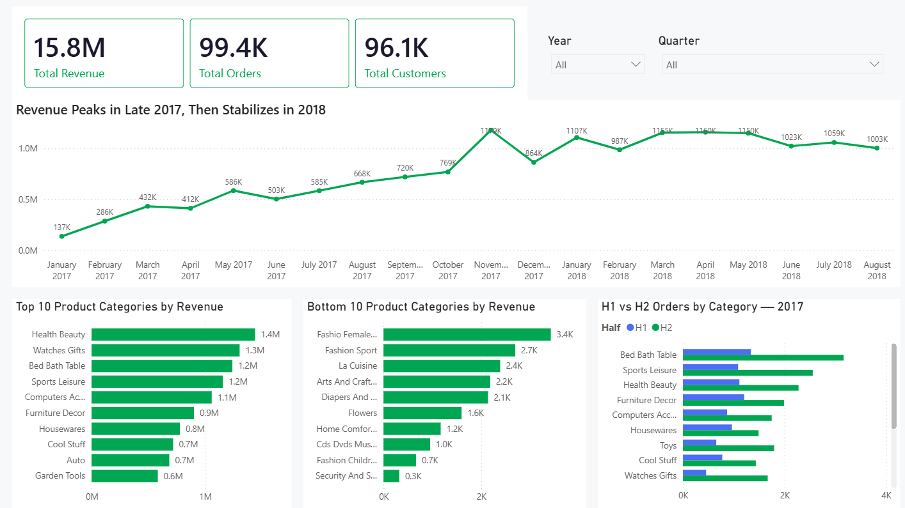
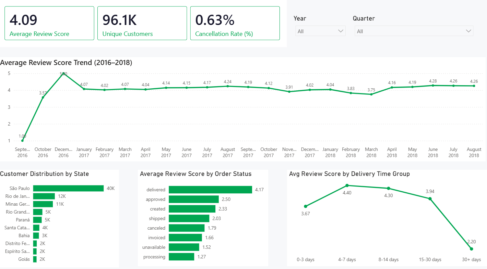
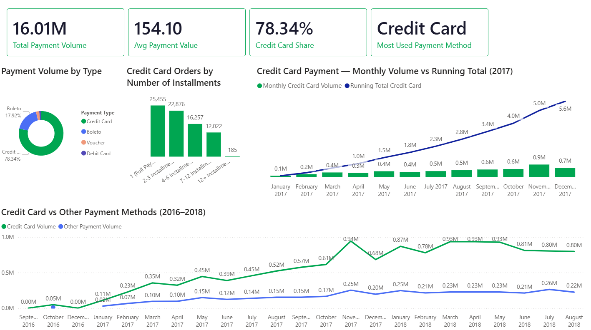

# 🛒 Olist Brazilian E-Commerce Analysis

A end-to-end data analytics project analyzing the 
[Olist Brazilian E-Commerce Public Dataset](https://www.kaggle.com/datasets/olistbr/brazilian-ecommerce) 
from Kaggle. This project covers database design, data cleaning, 
SQL analysis, and Power BI visualization across three focus areas: 
**Sales Performance**, **Customer Behavior**, and **Payment Patterns**.

---

## 📌 Project Overview

This project was built as a comprehensive skills assessment covering 
the full analytics workflow — from raw CSV import to executive-level 
insights. It demonstrates proficiency in SQL Server, Power BI, DAX, 
Python, and data storytelling.

**Key Questions Answered:**
- Which product categories drive the most revenue?
- How does delivery time impact customer satisfaction?
- What payment methods do Brazilian consumers prefer?
- Is there a seasonal pattern in orders and revenue?

---

## 🛠️ Tools & Technologies

| Tool | Purpose |
|------|---------|
| Microsoft SQL Server | Database design, import, querying |
| Python | Data cleaning (embedded newlines in CSV) |
| Power BI | Data modeling, DAX measures, dashboards |
| Canva | Case study presentation design |
| Kaggle | Dataset source |

---

## 📂 Dataset

**Source:** [Olist Brazilian E-Commerce Public Dataset](https://www.kaggle.com/datasets/olistbr/brazilian-ecommerce)

The dataset contains **11 interrelated CSV files** covering:

| Table | Description |
|-------|-------------|
| olist_orders_dataset | Order headers and status |
| olist_customers_dataset | Customer information |
| olist_order_items_dataset | Line items per order |
| olist_order_payments_dataset | Payment transactions |
| olist_order_reviews_dataset | Customer reviews |
| olist_products_dataset | Product catalog |
| olist_sellers_dataset | Seller information |
| olist_geolocation_dataset | ZIP code coordinates |
| olist_marketing_qualified_leads_dataset | MQL leads |
| olist_closed_deals_dataset | Closed sales deals |
| product_category_name_translation | Category name translations |

---

## 📈 Power BI Dashboard

**Data Model**

The Power BI report consists of 3 pages:

**Page 1 — Sales Performance**

- Revenue trend (2016–2018)
- Top 10 and Bottom 10 product categories by revenue
- H1 vs H2 orders by category (2017 seasonality)

**Page 2 — Customer Behavior**

- Average review score trend
- Customer distribution by state
- Review score by order status
- Delivery time vs customer satisfaction

**Page 3 — Payment Patterns**

- Payment volume by type (donut chart)
- Credit card installment behavior
- Monthly credit card volume vs running total (2017)
- Credit card vs other payment methods trend

**DAX measures used:**
- `Total Revenue` — SUMX across price + freight
- `Total Orders` — DISTINCTCOUNT of order_id
- `Avg Review Score` — AVERAGE of review_score
- `Cancellation Rate` — DIVIDE with REMOVEFILTERS
- `Running Total Credit Card` — SUM OVER with ALLSELECTED
- `Credit Card Share` — DIVIDE with ALL

---

## 🔍 Key Findings

1. **Seasonality is real** — H2 consistently outperforms H1 across every 
   product category in 2017. November is the clear revenue peak at R$1.17M.

2. **Delivery speed drives satisfaction** — Orders delivered in 4–7 days 
   average a 4.40 review score. Orders taking 30+ days drop to 2.20.

3. **Credit card dominates** — 78.34% of total payment volume. Nearly 75% 
   of credit card users prefer installment payments (parcelamento culture).

---
